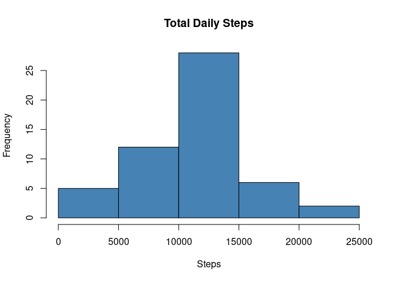
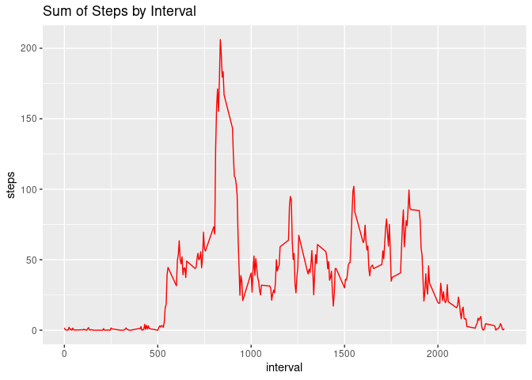
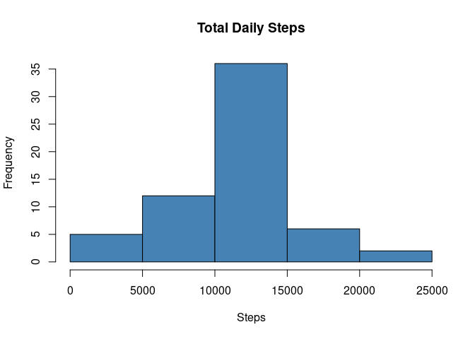
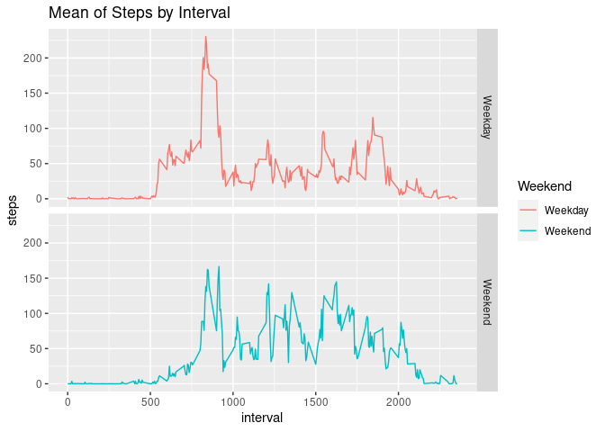

## Loading and preprocessing the data

```r
if(!file.exists("activity.csv")){
  unzip("activity.zip")
}
activity_data <- read.csv("activity.csv")
activity_data <- activity_data[!is.na(activity_data[,"steps"]),]
activity_data$date <- as.Date(as.character(activity_data$date))
```


## What is mean total number of steps taken per day?


```r
Grouped_data <- aggregate(activity_data$steps, by = list(activity_data$date), sum)
names(Grouped_data) <- c("date", "total_steps")

hist(Grouped_data$total_steps, xlab = "Steps", main = "Total Daily Steps", col = "steelblue")
```

<!-- -->

```r
print(paste("Mean number of steps taken daily", mean(Grouped_data$total_steps)))
```

```
## [1] "Mean number of steps taken daily 10766.1886792453"
```

```r
print(paste("Median number of steps taken daily", median(Grouped_data$total_steps)))
```

```
## [1] "Median number of steps taken daily 10765"
```

## What is the average daily activity pattern?


```r
library(ggplot2)
Mean_Data_By_Interval <- aggregate(activity_data$steps, by=list(activity_data$interval), mean)
names(Mean_Data_By_Interval) <- c("interval", "steps")

ggplot(Mean_Data_By_Interval, aes(x = interval, y=steps)) +
  labs(title = "Sum of Steps by Interval", x = "interval", y = "steps")+
  geom_line(color="red") 
```

<!-- -->

```r
maxInterval <- Mean_Data_By_Interval[which.max(Mean_Data_By_Interval$steps),]
maxInterval
```

```
##     interval    steps
## 104      835 206.1698
```


## Imputing missing values


```r
activity_data <- read.csv("activity.csv")
missing_values <- is.na(activity_data$steps)
print(paste("Number of Missing values are", sum(missing_values)))
```

```
## [1] "Number of Missing values are 2304"
```

```r
clean_activity_data <- activity_data[!missing_values,]
mean_values <- tapply(clean_activity_data$steps, clean_activity_data$interval, mean, na.rm=TRUE, simplify=TRUE)
activity_data$steps[missing_values] <- mean_values[as.character(activity_data$interval[missing_values])]
print(paste("Number of Missing values after imputing", sum(is.na(activity_data$steps))))
```

```
## [1] "Number of Missing values after imputing 0"
```

```r
Grouped_data <- aggregate(activity_data$steps, by = list(activity_data$date), sum)
names(Grouped_data) <- c("Date", "total_steps")
hist(Grouped_data$total_steps, xlab = "Steps", main = "Total Daily Steps", col = "steelblue")
```

<!-- -->

```r
print(paste("Mean number of steps taken daily", mean(Grouped_data$total_steps)))
```

```
## [1] "Mean number of steps taken daily 10766.1886792453"
```

```r
print(paste("Median number of steps taken daily", median(Grouped_data$total_steps)))
```

```
## [1] "Median number of steps taken daily 10766.1886792453"
```

The original mean and median were 10766.1886792453 and 10765, respectively.
Mean value remained the same while median has increased by 1.1886792453.

The effect of using mean data per interval as a data impute method for missing values seems to push overall data towards the mean.

## Are there differences in activity patterns between weekdays and weekends?


```r
activity_data$date <- as.Date(as.character(activity_data$date))
activity_data$weekday <- weekdays(activity_data$date)
activity_data$weekend <- ifelse (activity_data$weekday == "Saturday" | activity_data$weekday == "Sunday", "Weekend", "Weekday")
Grouped_data <- aggregate(activity_data$steps, by = list(activity_data$weekend, activity_data$interval), mean)
names(Grouped_data) <- c("Weekend", "Interval", "Steps")
ggplot(Grouped_data, aes(x = Interval, y=Steps, color=Weekend)) +
  geom_line() +
  facet_grid(Weekend ~ .) +
  labs(title = "Mean of Steps by Interval", x = "interval", y = "steps")
```

<!-- -->

There seems to be variation in the beginning of the day during weekdays, likely due to workplace activities. There seems to be an overall slightly larger incidence of steps during the weekends.
